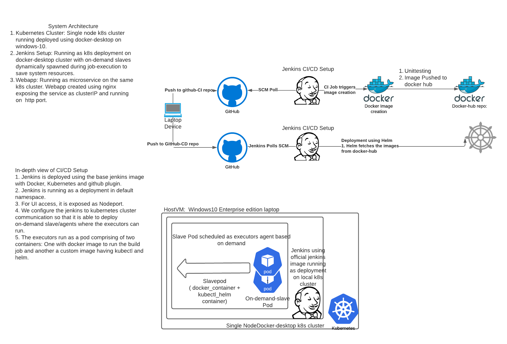

# Problem Statement

Description: Create a sample web page and deploy it as a microservice in a kubernetes cluster
1. Create two versions of a sample webpage (html) using apache/nginx
    a. Version 1 html content - “Welcome to sample App Ver-1”
    b. Version 2 html content - “Welcome to sample App Ver-2”
2. Use Helm to create version1 and version 2 packages.
3. Create seperate CI-CD pipeline for package build and deployment.
4. Deploy version 1 and the version-1 html content should be accessible in the browser (local). Document the steps followed in detail with screenshots. Repeat the same for deploying version 2.
5. For accessing web pages in the browser, expose the service using nodeport or cluster IP as convenient.
6. Deployment pipeline should deploy on a minikube or single node kubernetes cluster
    a. Pipeline should be created using Jenkins
    b. Use scripting languages for package build and deployment (Preferred: Groovy, Python, Bash)

# Solution
The solution is as given below:
## [architecture](#architecture)
## [AppDevelopment](#appdev)
## [AppUpdate](#appupdates)
## [The "misses"](#missed)

# System Architecture 
Please refer to attached snapshot for the details of the system architecture. 
K8s cluster URL: https://kubernetes.docker.internal:6443
Jenkins Service URL: http://10.1.0.148:8080

# App Development 
1. The app is created using nginx base image.
2. content of the file for both version-1 and version-2 are mapped to index.html so that on hitting the nginx endpoint proper html is displayed.
3. Any change performed by the developer in the CI branch will trigger a CI build which will build the docker image and push the image to docker-hub repo.
Note:
    1. Docker repo URL: https://hub.docker.com/repository/docker/bibhav2937/espace 

# App Update 
Rolling out new version of the app is two step-process in this solution.
1. Developer creates a new image with the required change (HTML content changed to display new required text). This is done using CI and a new image is pushed to docker repo.
2. Developer updates the new image and tag in the values.yaml file of helm-chart of the CD repo (https://github.com/bibhav2937/espacecd/tree/espacecd). This triggers the CD deployment.

Note: This is not a very clean solution and in production environments the new version of the apps are rolled out using deployment strategy like Blue-Green deployment, Canary deployment or using k8s inbuilt rolloutstrategy. but for the sake of this demo. I have provided a approach where the old-version of the app is taken down first and then a new version is rolled out. This strategy has drawbacks of down-time in production environment but have gone for simple approach for this demo.

# Good to have but didn't implement it. 
These are the few good-to-have-things in the end-to-end solution which was not implemented due to lack of time.
1. There should be a unit-testing stage in the CI that should check for the image and functionality in the local environment first.
2. Rollout of the app should be done using canary based approach.
3. Credentials to the repo should be stored securely either in jenkins creds manager or in some external vaults(like: hashicorp vault) but the solution directly takes the creds as variable.

ForDEmMO

